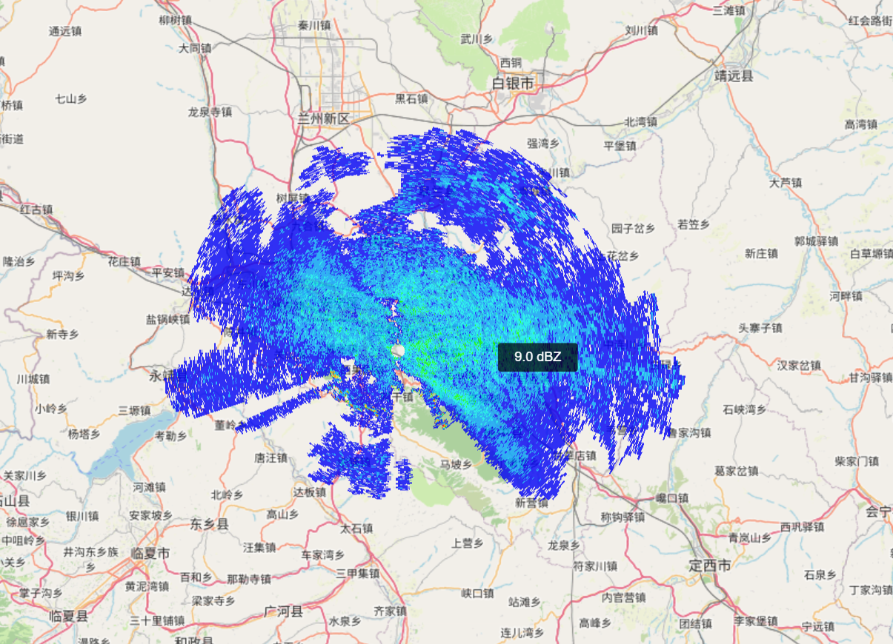
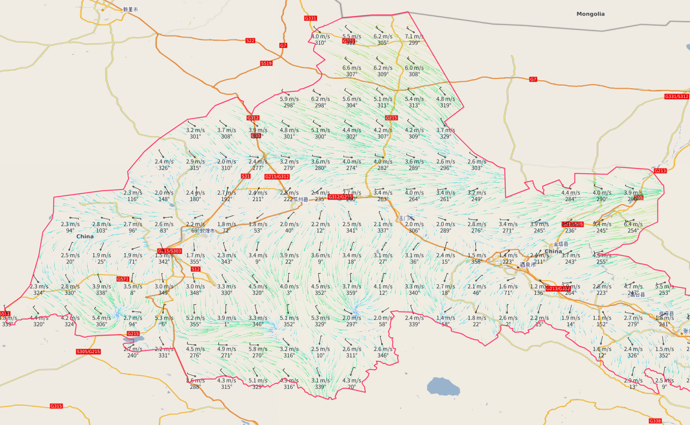
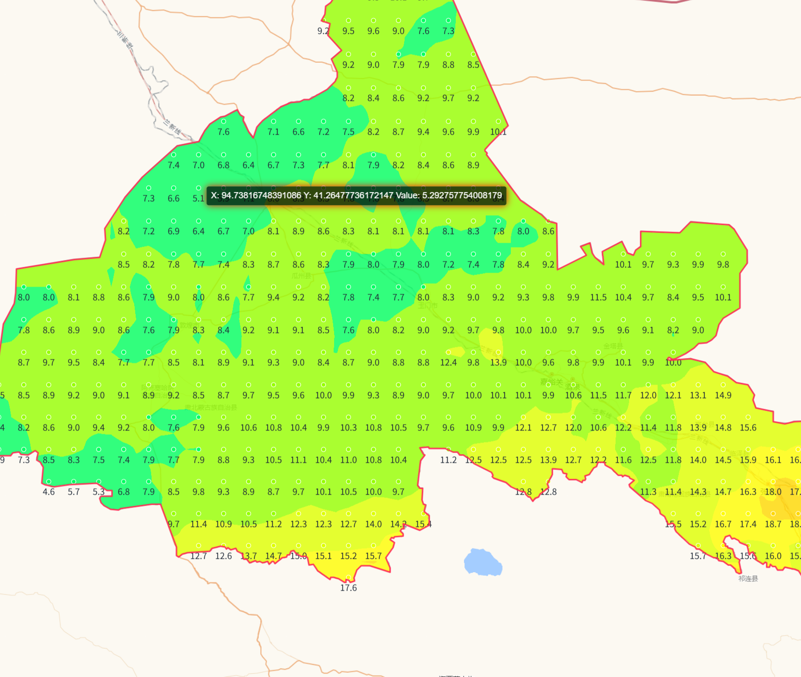

# m4文件绘图程序

[](https://www.npmjs.com/package/m4-w-fast)
[](https://www.npmjs.com/package/m4-w-fast)

---





### 使用

```shell
npm i m4-w-fast
```

---

### [文档](https://priestqing.github.io/m4-w-fast/)

---

#### @author: wangrl
#### @email: a790283379@outlook.com