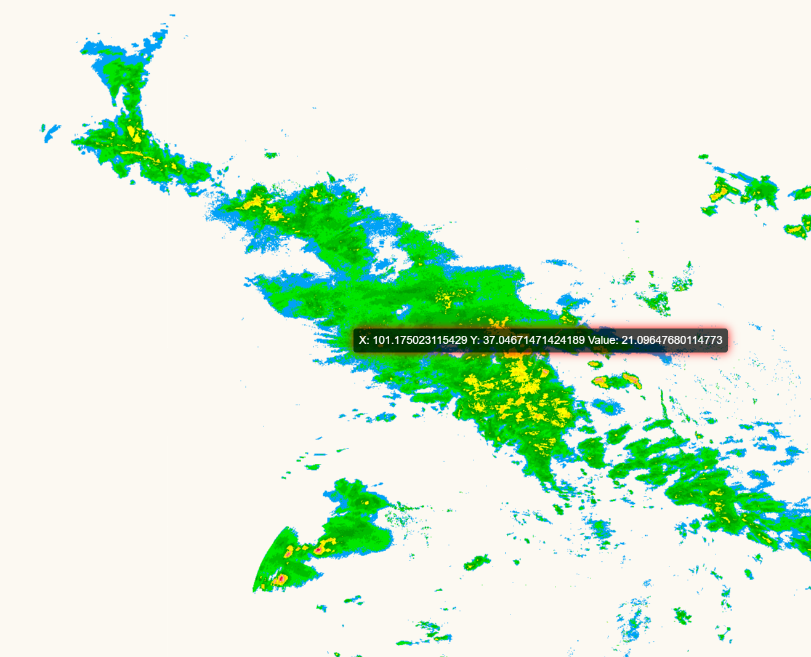

# m4文件绘图程序

[](https://www.npmjs.com/package/m4-w-fast)
[](https://www.npmjs.com/package/m4-w-fast)

[在线 demo](https://priestqing.github.io/m4-w-fast/)
---


### 更新说明
- v1.1.1
  - 新增基于 `Leaflet` + `WebGPU` 的道路图层方案, 支持将 `LineString` / `MultiLineString` 道路 GeoJSON 按栅格值着色
- v1.1.0
  - 正式启动主推 `leaflet canvas图层`方案
  - 现已支持`webgl2`, `webgpu`
  - 增加了 `tooltip`属性, `raster:hover`,`raster:click`事件, 用于拾取当前鼠标所在的格点数据
  - 裁图在计划中...
- v1.0.13
  - 新增了基于`leaflet` + `webgl2`的绘图方案, 这个方案可以使用`tif`, `micaps4`, `setParams()`的方式获取到一个图层, 图层在变化的时候会进行重采样和插值, 理论上可以流畅的过滤数据或者放大不虚
  - 后续计划增加`AMap`, `webgl`, `webgpu`方案.
  - 裁剪数据也在计划中, 目前已知裁图在边界上会有锯齿状的边缘
- v1.0.12
  - 新增 `getIsoBandsFastByMask(breaks: number[])` 方法, 和`getIsoBandsFast()`方法类似, 区别在于他做了数据挖孔, 可以给图层设置透明度而不影响图层的叠加效果
- v1.0.11
  - 修复了在 `vite8` 环境下的验证问题, 导出更加严格
- v1.0.10
  - 修复了 `getIsoBandsCanvas` 方法在`lat格距`为负值时结果不正确的问题
- v1.0.9:
  - 新增`buildGridLineCanvas(options?: CanvasOptions)` 用于输出一个基于数据栅格的 `HTMLCanvasElement`, 只是个格子
  - 新增`buildGridCanvas(breaks: number[], colors: (number[] | string)[], options?: CanvasOptions): HTMLCanvasElement | null` 用于输出一个基于数据栅格的 `HTMLCanvasElement`, 有填色
  - 新增`buildGridCanvasClipByJson(breaks: number[], colors: (number[] | string)[], json: FeatureCollection, options?: CanvasOptions): HTMLCanvasElement | null` 用于输出一个基于数据栅格的 `HTMLCanvasElement`, 有填色并裁剪
- v1.0.8:
  - 修复`getIsoBandsFast()`的返回类型兼容问题
  - 新增`getIsoBandsCanvas(breaks: number[], colors: (number[] | string)[], options?: CanvasOptions)` 用于输出一个 `HTMLCanvasElement` 方便做图片操作
  - 新增`getIsoBandsCanvasByMap(breaks: number[], colors: (number[] | string)[], map: L.Map, options?: CanvasOptions)` 用于输出一个基于 `Leaflet` 地图的 `HTMLCanvasElement`, 他的区别是实际坐标和地图坐标一致, 而不是标准的等值
  - ~~新增`buildGridCanvas(options?: CanvasOptions)` 用于输出一个基于数据栅格的 `HTMLCanvasElement`, 只是个格子~~
  - 新增`updateGridCanvas(points: Point[], updateVal: number)` 用于更新格点数据
  - 新增 `umd` 版本支持, 可以直接通过 `script` 标签引入使用, 全局注册变量命名为 `M4WFast`
- v1.0.7:
  - 修复`getIsoBandsFast()`的结果在裁剪时不匹配的问题
- v1.0.6:
  - 优化`getIsoBandsFast()`的绘图效果, 基于面积排序的结果存在一些未达预期的效果, 后续可能会撤销`getIsoBandsFastByWorker()`方法
- v1.0.5:
  - `.start()`方法提供了一个Promise.reject的错误回调, 用于捕获文件读取错误
  - 优化了在少数情况下, 绘图会出现有值但没有被绘制的问题
- v1.0.4:
  - 提供了一个 `setParams(params: ParamsConfig, config?: ReadConfig)` 方法, 用于设置动态参数, 而非固定从文件获取数据
  - 拆解了 `start()` 方法中的 `json: JSONData[]` 拼装, 如果需要json数据, 可以调用 `getJsonData()` 方法获取
    - **注意: 这里获取到的数据,和`start(config? ReadConfig)`或`setParams(params: ParamsConfig, config?: ReadConfig)`中的config有关**
  - 扩展了 `ReadConfig` 配置项, 新增:
    - `plusOffset?: number` 数据偏移量, 默认无偏移
  - ~~`getIsoBandsFastByWorker()` 和 `clipDataByJson()` 方法新增了 `useCpuCount` 参数, 用于设置`CPU`使用数量, 默认为`navigator.hardwareConcurrency - 4`~~
- v1.0.3:
  - 添加了m4文件换行符的兼容
  - 增加了配置项在解析的时候将开氏度转换为摄氏度 (K -> ℃) (-272.15)
    - `read.start({ convertTemKtoC: true })`
- v1.0.2: 新增了一个可以单独获取某一个break的等值面方法 `getIsoBandsByLayerBreak(breaks: number[], break: number)`
  - **注意: 这个方法只用于取单等值面, 如果你需要获取所有等值面, 还是用 `getIsoBandsFast` 或者 `getIsoBandsFastByWorker` 方法**
- v1.0.1: 修复了安装在vite环境打包时woker不正常工作的问题


### 使用

1. 安装这个库
```shell
npm i m4-w-fast
```

---
# leaflet canvas图层
- 理论上可以流畅的过滤数据或者放大不虚, 这可能是当前包体中显示最优的方案
- 现已支持 webgl2, webgpu
- UMD 使用 `M4WRasterOverlay`

```ts
import { createRasterLeafletLayer, loadRasterGrid } from 'm4-w-fast/raster-overlay'

//...

const grid = await loadRasterGrid({
  type: 'tif',
  url: 'xxx'
})

// micaps4
// const grid = await loadRasterGrid({
//   type: 'micaps4',
//   url: 'xxx'
// })

// params
// const grid = await loadRasterGrid({
//     type: 'params',
//     params: {
//         values: Array.from({ length: 512 * 256 }, () => Math.random() * 60 - 30),
//         nx: 512,
//         ny: 256,
//         minLng: 70,
//         minLat: 15,
//         gjLng: 0.1,
//         gjLat: 0.1,
//         flipY: true, //是否翻转数据
//         valueScale: 1
//     }
// })

const layer = createRasterLeafletLayer({
  rendererType: 'webgl2',
  grid,
  colorStops: legend,   // {min: number, max:number, color: string}[]
  colorRange: {
    minValue: Number(minInput.value),   // 过滤的最小值
    maxValue: Number(maxInput.value)    // 过滤的最大值
  },
  opacity: 1,
  colorMode: 'step', // 'step' | 'smooth'
  sampleMode: 'interpolate', // 'interpolate' | 'cell'
  pane: 'raster-pane',
  tooltip: {
      enabled: true,
      formatter: (result) => {
          return `<div>${result.value.toFixed(2)}</div>`
      }
  }
})

// layer.setColorRange({ minValue, maxValue }) 动态变化

layer.on('raster:hover', event => {
  console.log(event.result)
})

layer.on('raster:click', event => {
  console.log(event.result)
})

```

# 道路 WebGPU 图层

- 用于把道路 GeoJSON 叠加到 Leaflet 地图上, 并根据栅格数据采样值给道路着色
- 当前道路示例建议使用 `rendererType: 'webgpu'`, 浏览器需要支持 `navigator.gpu`
- 道路数据支持 `LineString` / `MultiLineString`
- `grid` 和 `source` 二选一传入, `grid` 可以通过 `loadRasterGrid()` 预加载
- 如果道路和栅格是 WGS84, 底图使用高德 GCJ-02, 设置 `coordinateTransform: 'wgs84-to-gcj02'`
- UMD 使用 `M4WRoadOverlay`。

```ts
import * as L from 'leaflet'
import { loadRasterGrid } from 'm4-w-fast/raster-overlay'
import { createRoadLeafletLayer } from 'm4-w-fast/road-overlay'
import type { RoadGeoJsonInput } from 'm4-w-fast/road-overlay'

const map = L.map('map', {
    center: [35.97, 103.75],
    zoom: 11
})

map.createPane('road-pane')

const roadPane = map.getPane('road-pane')

if (roadPane) {
    roadPane.style.zIndex = '400'
}

// 这里是你的道路 GeoJSON, 只支持 LineString / MultiLineString
const roadsResponse = await fetch('/road.json')
const roads = await roadsResponse.json() as RoadGeoJsonInput

const grid = await loadRasterGrid({
    type: 'micaps4',
    url: '/2510270910.015'
})

const roadLayer = await createRoadLeafletLayer({
    rendererType: 'webgpu',
    coordinateTransform: 'wgs84-to-gcj02',
    roads,
    grid,
    colorStops: legend,
    colorRange: {
        minValue: 0,
        maxValue: 75
    },
    colorMode: 'step',
    sampleMode: 'interpolate',
    opacity: 1,
    lineWidth: 8,
    pane: 'road-pane'
})

roadLayer.addTo(map)
```

---

# geojson图层
- UMD 使用 `M4WFast`

2. 使用示例
```vue
<script lang="ts" setup>
import * as L from 'leaflet'
import 'leaflet/dist/leaflet.css'
import ReadFileM4Fast from 'm4-w-fast'

const file = '' // 这里是你的m4文件路径

const init = async() => ｛
    const read = new ReadFileM4Fast(file)
    await read.start()
    // 此时, 你已经有解析过的数据了

    // 开始计算等值面
    const break = [] // 这里取决于你的色标分级
    const isoBands = read.getIsoBandsFast(break)

    // 叠加绘图 leaflet为例
    L.geoJson(isoBands, {
        style(feature) {
            if (!feature) return {}
            const z = feature.properties.z
            const rgba = read.getColorFast(z, level, color)
            return {
                weight: 3,
                opacity: 1,
                color: 'red',
                stroke: false,  // 如果你需要等值线开启他
                fillColor: rgba,
                fillOpacity: 0.5
            }
        }
    }).addTo(map)
｝
</script>
```

3. 获取某一个break的等值面示例
```typescript
clearMap()
const oneIsoBand = read.getIsoBandsByLayerBreak(lLevel.value, level)
const geo = L.geoJson(oneIsoBand, {
    style(feature) {
        if (!feature) return {}
        const z = feature.properties.z
        const rgba = read!.getColorFast(z, lLevel.value, lColor.value)
        return {
            opacity: 1,
            stroke: false,
            fillColor: rgba,
            fillOpacity: 1
        }
    }
}).addTo(map!)

```
4. 使用 `setParams` 方法动态设置参数示例
```typescript

const read = new ReadFileM4Fast()
read.setParams({
    values: dataValues,
    nx: dataNx,
    ny: dataNy,
    minLng: dataMinLng,
    minLat: dataMinLat,
    gjLng: dataGjLng,
    gjLat: dataGjLat
})

```

### 类型参照

> RasterLeafletLayerCreateOptions

| 参数 | 说明 | 类型 | 默认值 |
|----|----|----|----|
| `rendererType` | 渲染方式 | `'cpu' \| 'webgl' \| 'webgl2' \| 'webgpu'` | 必填 |
| `grid` | 栅格数据, 可通过 `loadRasterGrid()` 获取 | `RasterGrid` | 必填 |
| `colorStops` | 色标配置 | `{ min: number, max: number, color: string }[]` | 必填 |
| `colorRange` | 当前显示的数据范围, 常用于滑块过滤 | `{ minValue: number, maxValue: number }` | 色标最小最大值 |
| `opacity` | 图层透明度 | `number` | 渲染器默认值 |
| `colorMode` | 颜色映射模式 | `'step' \| 'smooth'` | `'step'` |
| `sampleMode` | 栅格采样模式 | `'interpolate' \| 'cell'` | `'interpolate'` |
| `pane` | Leaflet pane 名称 | `string` | Leaflet 默认 overlayPane |
| `tooltip` | 内置 tooltip 配置 | `RasterTooltipOptions` | 不启用 |
| `onHover` | 鼠标移动查询回调 | `(result) => void` | 无 |
| `onClick` | 鼠标点击查询回调 | `(result) => void` | 无 |

> RasterLeafletLayer

| 方法 | 说明 |
|----|----|
| `setParams(params)` | 使用参数方式更新栅格数据 |
| `setSource(source)` | 使用 `tif` / `micaps4` / `params` 数据源更新栅格数据 |
| `setGrid(grid)` | 直接更新栅格数据并重新上传纹理 |
| `setColorStops(colorStops)` | 动态更新色标 |
| `setColorRange(range)` | 动态更新显示值范围 |
| `setColorMode(colorMode)` | 动态切换色标模式, 支持 `step` / `smooth` |
| `setSampleMode(sampleMode)` | 动态切换采样模式, 支持 `interpolate` / `cell` |
| `setOpacity(opacity)` | 动态设置图层透明度 |
| `redraw()` | 手动重绘当前视口 |
| `getCanvas()` | 获取当前图层 canvas, 可用于导出图片 |
| `queryValueAt(point)` | 按统一 `x/y` 坐标查询栅格值 |
| `queryValueAtLatLng(latLng)` | 按 Leaflet 经纬度查询栅格值 |

---

> RoadLeafletLayer

| 方法 | 说明 |
|----|----|
| `redraw()` | 手动重绘道路图层 |
| `setOpacity(opacity)` | 动态设置道路透明度 |
| `setLineWidth(lineWidth)` | 动态设置道路线宽 |
| `setColorMode(colorMode)` | 动态切换色标模式, 支持 `step` / `smooth` |
| `setSampleMode(sampleMode)` | 动态切换采样模式, 支持 `interpolate` / `cell` |

---

> ReadConfig

| 参数 | 说明 | 类型        | 默认值   |
|----|----|-----------|-------|
|  convertTemKtoC  |  是否将温度从开氏度转换为摄氏度  | `boolean` | false |
|  plusOffset  |  数据偏移量  | `number`   | 无 |

---

> ParamsConfig

| 参数     | 说明 | 类型         | 默认值 |
|--------|----|------------|-----|
| values |  数据值数组  | `number[]` | []  |
| nx     |  栅格列数  | `number`     | 0   |
| ny     |  栅格行数  |   `number`         | 0   |
| minLng       |  最小经度  |    `number`        | 0   |
|  minLat      |  最小纬度  |     `number`       | 0   |
|  gjLng      |  经度分辨率  |    `number`        | 0   |
|  gjLat      |  纬度分辨率  |      `number`      | 0   |

---

> JSONData

| 参数     | 说明 | 类型         | 默认值 |
|---|---|---|---|
| lng     | 经度  | `number` | 0 |
| lat     | 纬度  | `number` | 0 |
| val   | 数据值 | `number` | 0 |


#### @author: wangrl
#### @email: a790283379@outlook.com